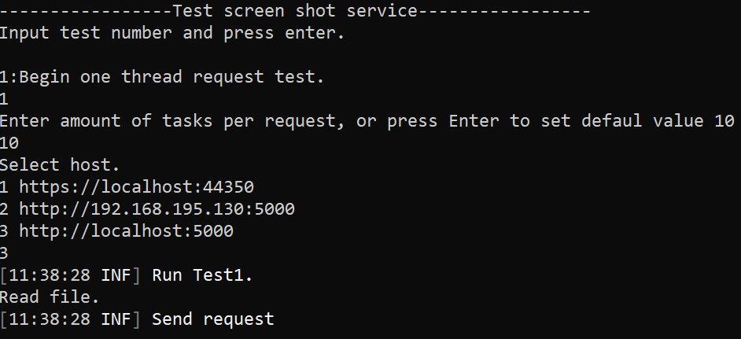
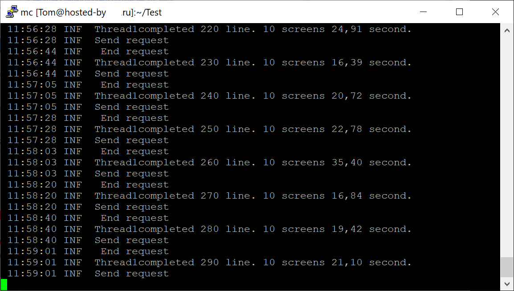
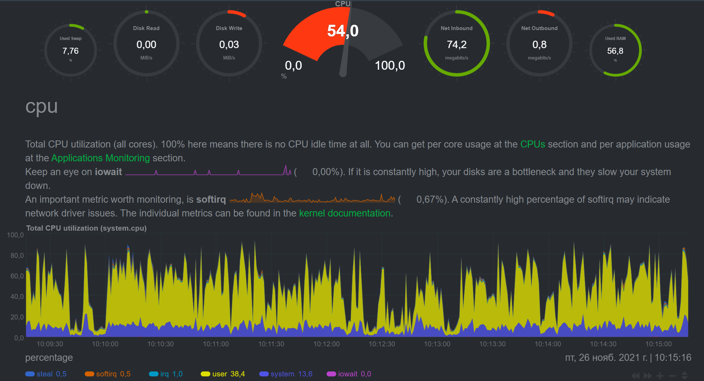
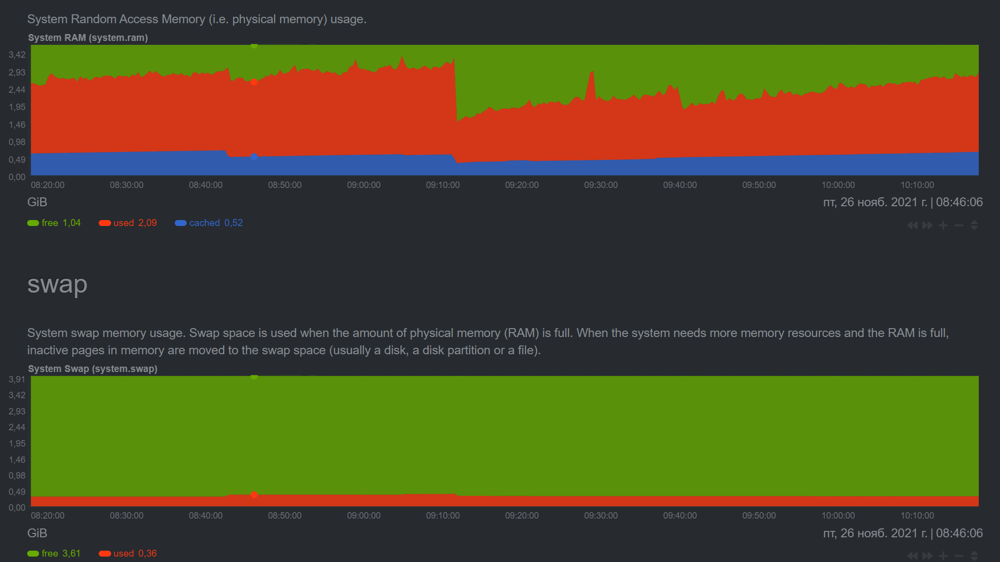
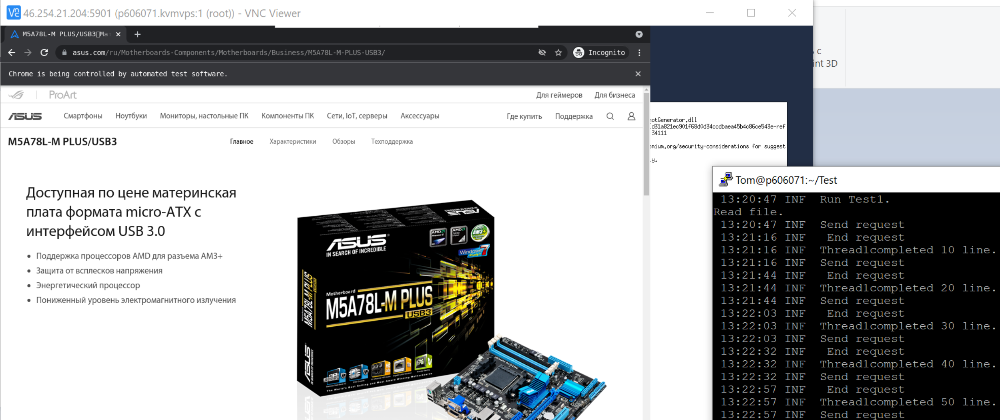

<h2>Тестирование.</h2>
Для тестирования сервиса используется консольное приложение TestServices.

ПО считывает требуемое количество строк из файла, отправляет запрос на сервис, ждет окончания ответа. Измеряет время выполнения запроса.
Результат выполнения задачи сохраняется в базу данных sqlite, а так же в log файл.

Работа теста на VPS сервере. Используется один браузер.

На 310 скринов затрачено 809секунд. В среднем один скрин делался 
2,6с. При работе двух браузеров время составляет 1,75с.

Нагрузка VPS при работе одного браузера.Используется Netdata.
Характеристики VPS-2CPU,4Гб RAM.

Пример мониторинга работы браузера Chrome с использование VNC и запущенного теста на VPS:

Сервис протестирован на ОС CentOs 8 Streame установленной на VMware 
Workstation 16 Pro(1ядро 2 потока, 4гб памяти). При запуске 4-х браузеров, максимальное количество используемой памяти 1.8Гб.

 Ведется тестирование на VPS.