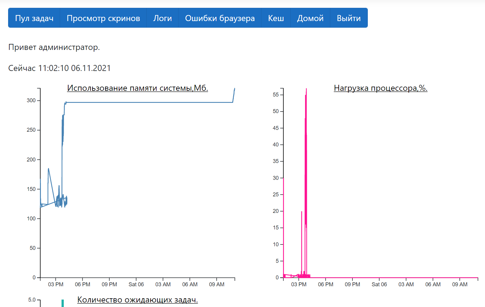
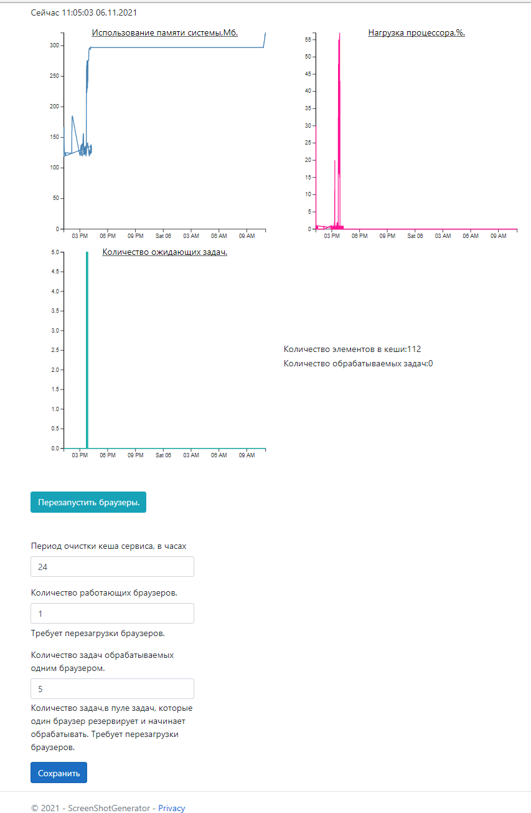
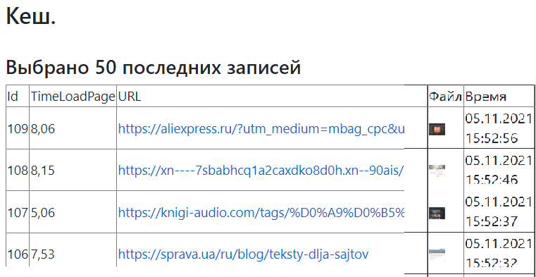
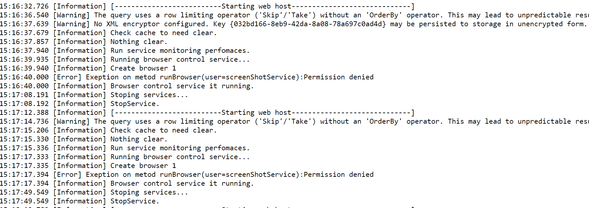
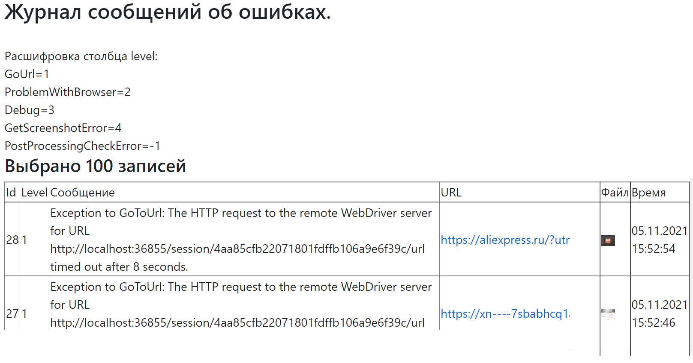

Asp net.core 5 приложение. 
Точный дизайн сайта пока не определен. 
Прототип новой(вместо js кода, работающего с 2013 года) реализации «скриншоттера».
 Front часть содержит авторизацию по логину и соцсети Facebook. 
 

  Если войти под администратором, пользователь попадает на админ панель.
   
  На ней отображаются графики нагрузки системы, и основные настройки:
    

  
  
 <h3 align="center">Вкладка "Кеш":</h3>
 
<h3 align="center">Вкладка "Логи":</h3>
 
<h3 align="center">Вкладка "Ошибки браузера":</h3>
 

Для хранения данных используется БД Postgresql. Логи за каждый день хранятся в Logs/.

