<h1 align="center">ScreenShotGenerator</h1>

<h2 align="center">Сервис создания скриншотов сайтов.</h2>

Asp net.core 5 приложение. 
Точный дизайн сайта пока не определен. 
Прототип новой реализации «скриншоттера» для onlinezakladki.ru.
 Front часть содержит авторизацию по логину и соцсети Facebook. 
 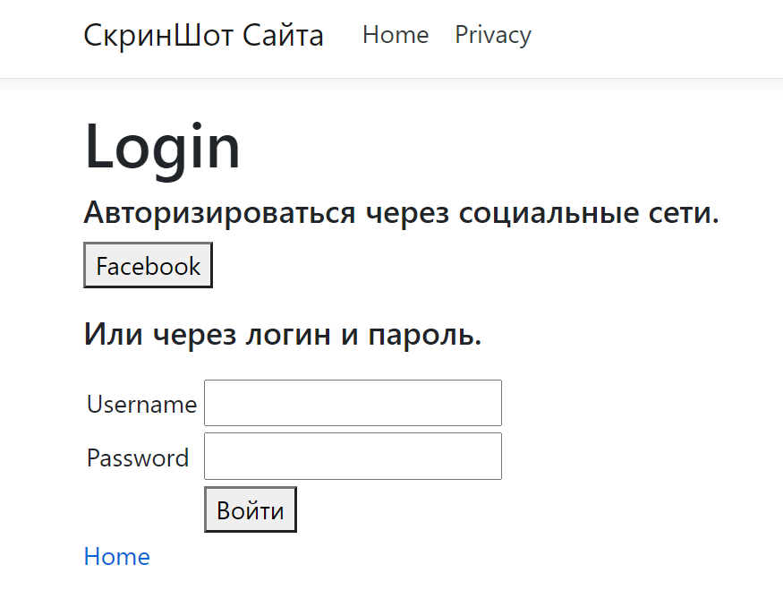

  Если войти под администратором, пользователь попадает на админ панель.
   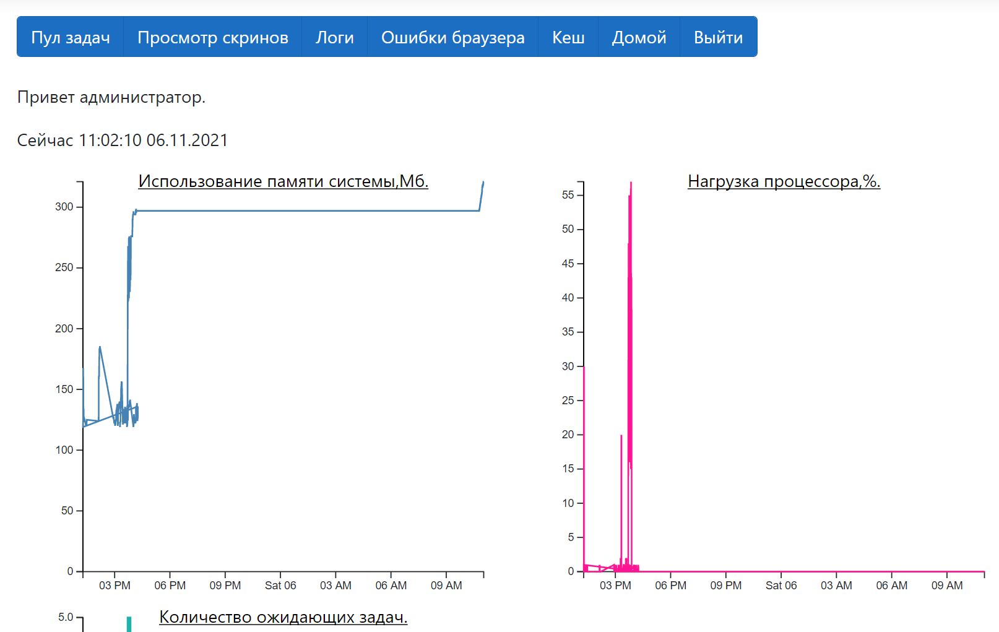
  На ней отображаются графики нагрузки системы, и основные настройки:
    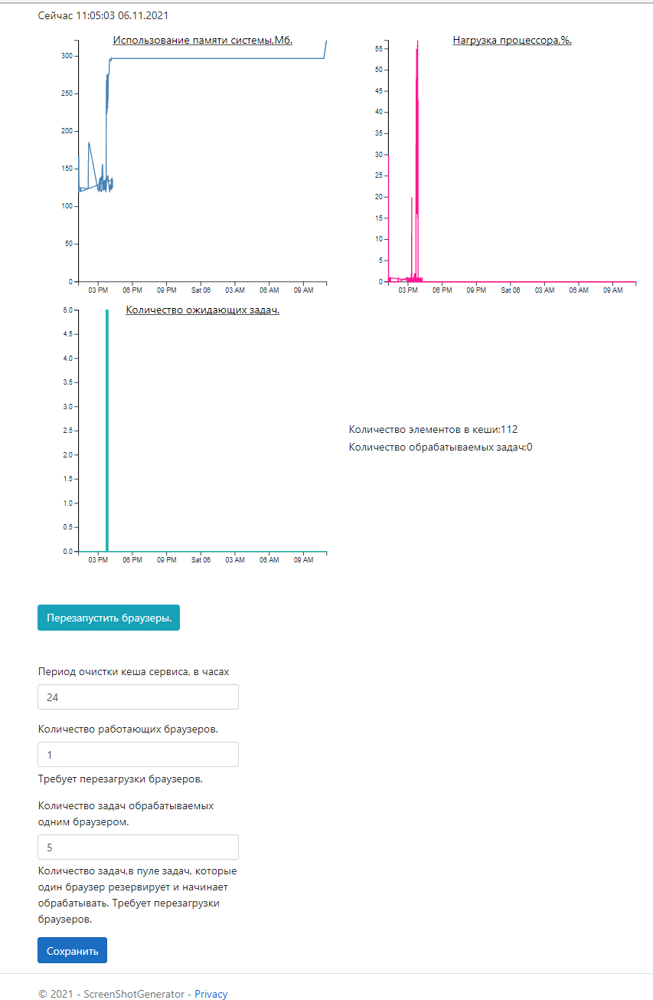

  
  
 <h3 align="center">Вкладка "Кеш":</h3>
 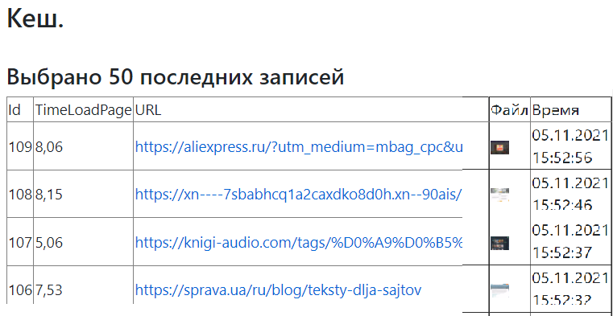
<h3 align="center">Вкладка "Логи":</h3>
 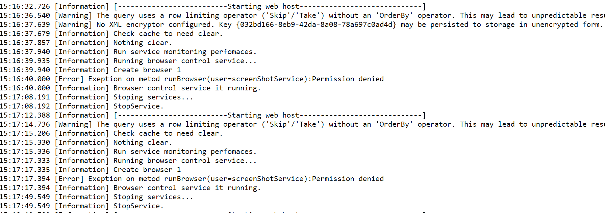
<h3 align="center">Вкладка "Ошибки браузера":</h3>
 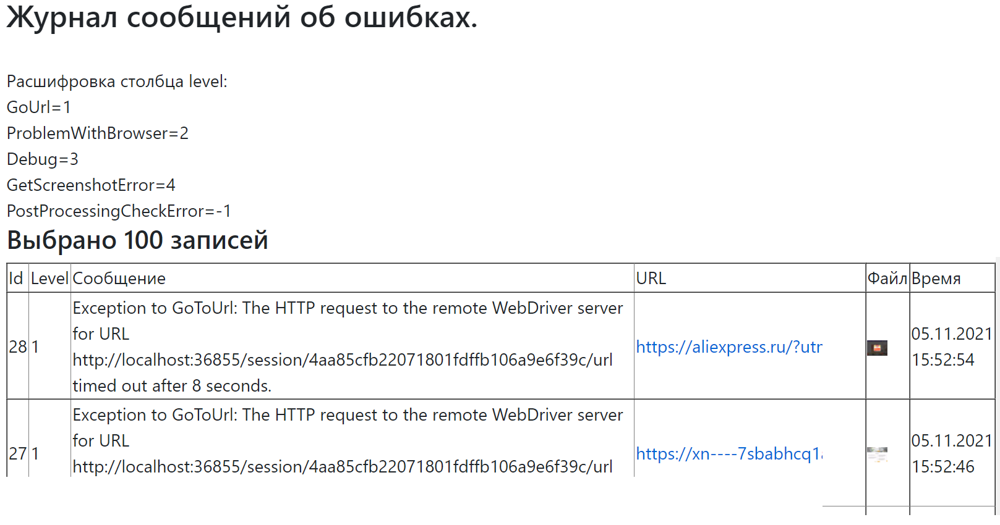

Для хранения данных используется БД Postgresql. Логи за каждый день хранятся в Logs/.

Создание скринов выполняет браузер google chrome, управляемый Selenium. Для ускорения работы каждый браузер работает в отдельном потоке и получает информацию о задачах из пула задач.
Среднее время выполнение скриншотта на медленном соединении-3.5c, на быстром соединении может достигать 1с.

<h2>API сервиса.</h2>

 Создать скрины по указанным адресам: 

 http://46.254.21.204//?url[0]=https://2ip.ru&url[1]=https://google.com&url[2]=https://yandex.com&allowedReferer=1

Ответ json(расширенный пример): 

 [{"url":"https://2ip.ru","status":1,"path":"https://localhost:44350/imgCache/804adce908a159417a4650eb38d01e35.jpg","log":""},{"url":"https://gosterfaber789.com","status":0,"path":null,"log":"Exception in metod takeScreenShot:unknown error: net::ERR_NAME_NOT_RESOLVED\n (Session info: chrome=94.0.4606.81)"},{"url":"https://mail.ru","status":1,"path":"https://localhost:44350/imgCache/c4a87b0e73965dcb6586a78ca4b63901.jpg","log":""}]

<h2>Тестирование.</h2>
Для тестирования сервиса используется net.core консольное приложение TestServices.
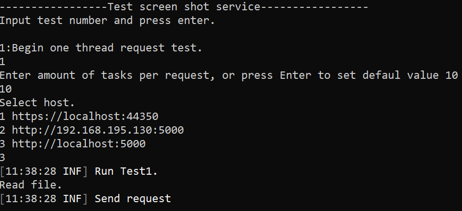
ПО считывает требуемое количество строк из файла, отправляет запрос на сервис, ждет окончания ответа. Измеряет время выполнения запроса.
Результат выполнения задачи сохраняется в базу данных sqlite, а так же в log файл.

Работа теста на VPS сервере. Используется один браузер.
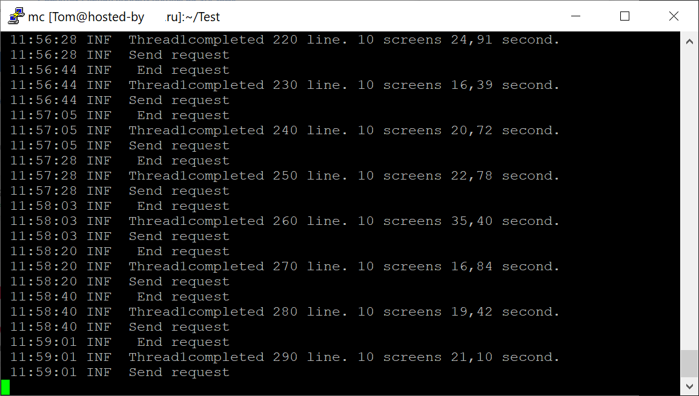
На 310 скринов затрачено 809секунд. В среднем один скрин делался 
2,6с. При работе двух браузеров время составляет 1,75с.

Нагрузка VPS при работе одного браузера.Используется Netdata.
Характеристики VPS-2CPU,4Гб RAM.
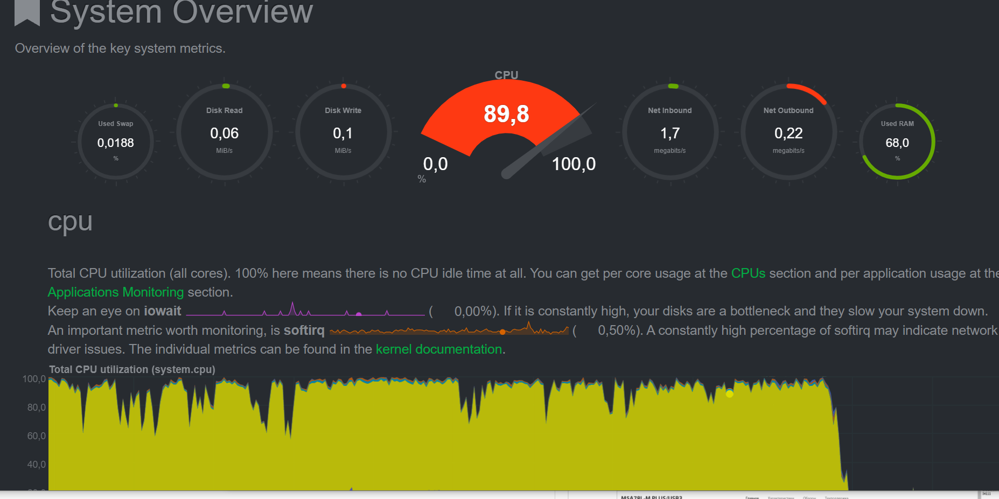
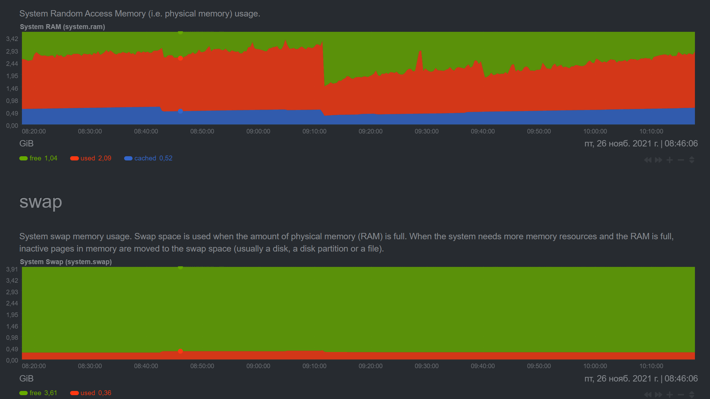

Пример мониторинга работы браузера Chrome с использование VNC и запущенного теста на VPS:
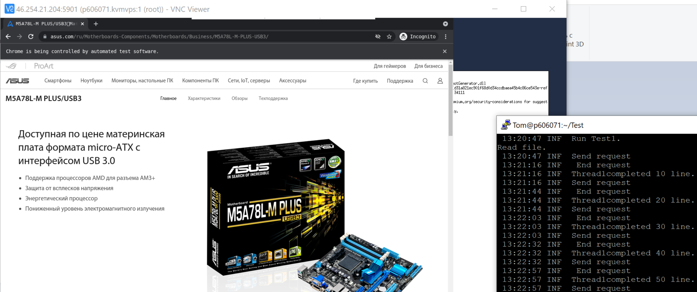

Сервис протестирован на ОС CentOs 8 Streame установленной на VMware 
Workstation 16 Pro(1ядро 2 потока, 4гб памяти). При запуске 4-х браузеров, максимальное количество используемой памяти 1.8Гб.

 Ведется тестирование на VPS.

При разработке сервиса возник ряд проблемм с браузерами. 
Браузер Chrome 95 версии(а так же Edge), теряет связь с драйвером после обработки некоторых сайтов. Причина не установлена. Больше не используется. 
Браузер firefox постепенно заполняет весь swap системы. Это приводит к остановке сервиса. 
Заполнение swap происходит из-за открытия вкладок(или то что браузер счетает ими). Визуально(если сделать скрин шот) новых вкладок почти ни когда не видно. 
Дополнения ublock,pupup blocked unlimite,addblock не решают данную проблемму. Закрытие окон после каждой операции и остановка выполнения скриптов лишь заметляет засорение swap.

На рисунке показано поведение браузера с установленным расширением AddBlock. Видно как браузер открыл 17вкладок.
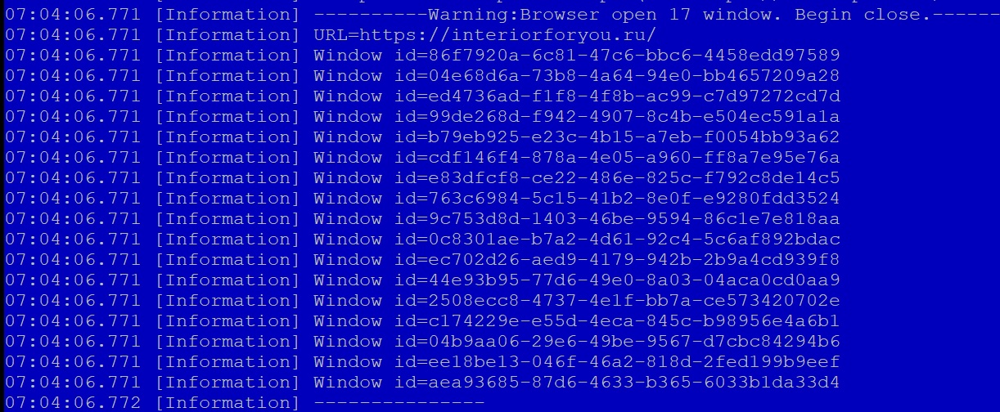

   

Для решения проблеммы переполнения swap был реализован механизм мониторинга, и перезапуска браузера при привышении лимита в 50Мб. 
Пики на рисунке приходятся на перезапуск браузера по превышению лимита swap. 
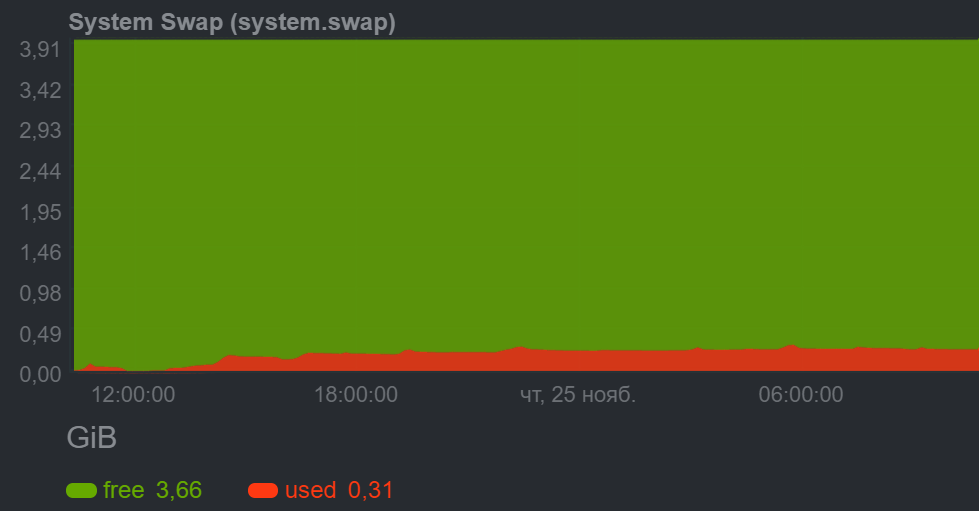

Но это до конца не решило проблемму. В некоторых случаях браузер может заполнить 1Гб swap за 30сек(мониторинг ведеться каждые 30сек).
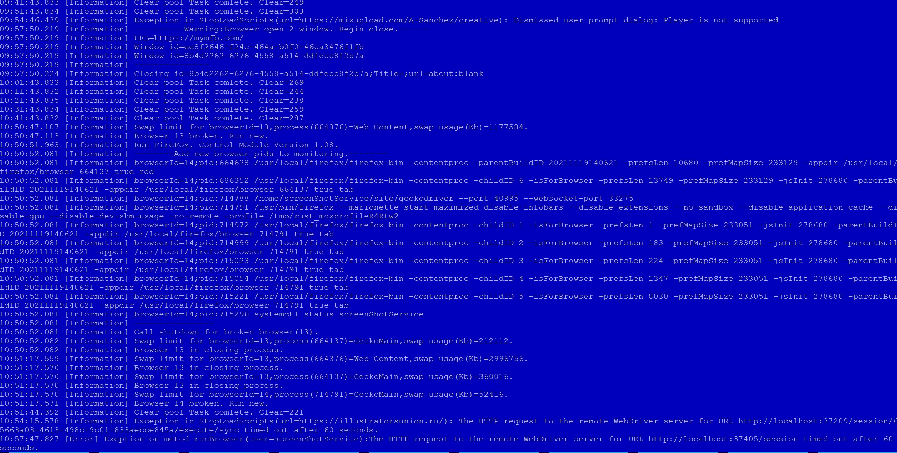

Был добавлен механизм аварийного остановки браузера.

Минимальная стабильная версия браузера Firefox,для работы с Selenium.WebDriver.GeckoDriver 0.30.0.1 -80.0. Драйвер ниже версии не умеет настраивать параметры профиля. Браузеры ниже версий после нескольких часов работы перестают работать.
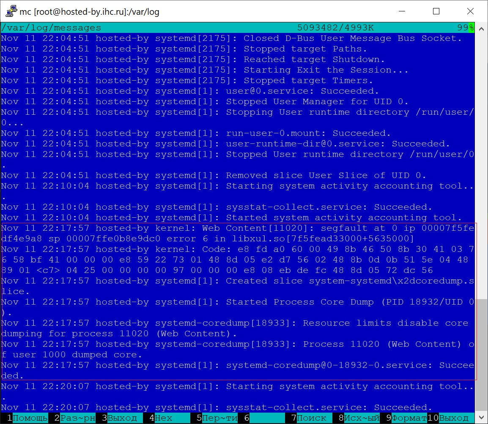

В процессе длительного теста была выявлена еще одна ошибка браузера:
После 2часов 14 минут(8040с) при переходе на about:blank браузер всегда возвращает ошибку 
«TimedPromise timed out after»  и  нормально делает скрин. На скрине есть картинка одного и того же сайта. Очевидно какого-то старого, до ошибки. Нагрузка процессора не подымается выше 10%, процессы браузера и драйвера работают(команда top).
Для решения этой проблемы был добавлен FirefoxTimedPromiseBlankPageMonitor. В случае повторного повторения(2раза) данной ошибки при переходе на пустую страницу возвращается ошибка «Браузер вышел из строя». 

<b>
Это закрытый проект. Исходные коды предоставлены исключительно для ознакомительных целей!
</b>

