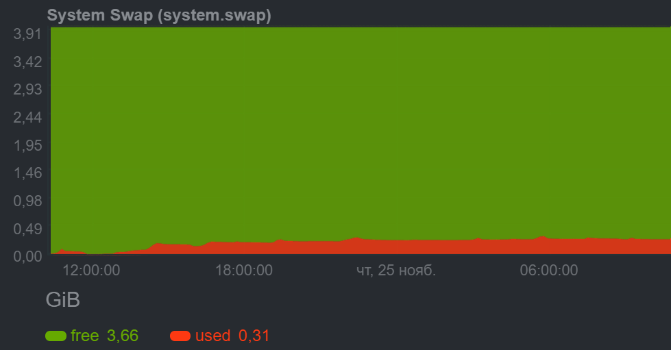

<h1 align="center">ScreenShotGenerator</h1>

<h2 align="center">Сервис создания скриншотов сайтов.</h2>

Цель данного проекта-проверка возможности использования Selenium в круглосуточном режиме и при длительной нагрузке(min 50 000 отпечатков в сутки) разным контентом.
После длительных тестов вывод автора-использование невозможно из-за проблем с самим драйвером. Ведется переработка на микро сервисную архитектуру и kubernetes.

С 01.04.2023 ведется работа по рефакторингу кода и создание упрощенной версии. Старый код удален из репозитория.

<a href="./Docs/UI/UI.md">Внешний вид UI</a> 

<a href="./Docs/Api/Api.md">Описание API</a> 

<a href="./Docs/TestMethod/TestMethod.md">Методика тестирования</a> 

 

<h2>Описание</h2> 

Создание скринов выполняет браузер Mozilla Firefox, управляемый Selenium. Для ускорения работы каждый браузер работает в отдельном потоке и получает информацию о задачах из пула задач.
Среднее время выполнение скриншотта на медленном соединении(100Мбит)-3.5c, на быстром соединении(1Гбит) может достигать 1с.

При разработке сервиса возник ряд проблемм с браузерами. 
Браузер Chrome 95 версии(а так же Edge), теряет связь с драйвером после обработки некоторых сайтов. Причина не установлена. Больше не используется. 
Браузер Firefox постепенно заполняет весь swap системы. Это приводит к остановке сервиса. 
Заполнение swap происходит из-за открытия вкладок(или то что браузер счетает ими). Визуально(если сделать скрин шот) новых вкладок почти ни когда не видно. 
Дополнения ublock,pupup blocked unlimite,addblock не решают данную проблемму. Закрытие окон после каждой операции и остановка выполнения скриптов лишь заметляет засорение swap.

Предполагается наличие утечки памяти в Selenium. 

На рисунке показано поведение браузера с установленным расширением AddBlock. Видно как браузер открыл 17вкладок.

   

Для решения проблеммы переполнения swap был реализован механизм мониторинга, и перезапуска браузера при привышении лимита в 50Мб. 
Пики на рисунке приходятся на перезапуск браузера по превышению лимита swap. 

Но это до конца не решило проблемму. В некоторых случаях браузер может заполнить 1Гб swap за 30сек(мониторинг ведеться каждые 30сек).

Был добавлен механизм аварийного остановки браузера.

Минимальная стабильная версия браузера Firefox,для работы с Selenium.WebDriver.GeckoDriver 0.30.0.1 -80.0. Драйвер ниже версии не умеет настраивать параметры профиля. Браузеры ниже версий после нескольких часов работы перестают работать.

В процессе длительного теста была выявлена еще одна ошибка браузера:
После 2часов 14 минут(8040с) при переходе на about:blank браузер всегда возвращает ошибку 
«TimedPromise timed out after»  и  нормально делает скрин. На скрине есть картинка одного и того же сайта. Очевидно какого-то старого, до ошибки. Нагрузка процессора не подымается выше 10%, процессы браузера и драйвера работают(команда top).
Для решения этой проблемы был добавлен FirefoxTimedPromiseBlankPageMonitor. В случае повторного повторения(2раза) данной ошибки при переходе на пустую страницу возвращается ошибка «Браузер вышел из строя». 

